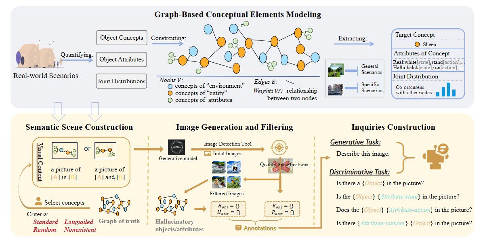

# ODE: Open-Set Evaluation of Hallucinations in Multimodal Large Language Models

## Introduction
The Open-Set Dynamic Evaluation (ODE) protocol  automatically generates datasets to evaluate object hallucinations in MLLMs, covering both existence-level and attribute-level hallucinations.



The workflow consists of four steps: modeling real-world scenarios using a graph structure, conceptual design of semantic scene, image generation and filtering, and template design for inquiries.


## Getting Started
### Installation
1. Install networkx

Use the following command to install networkx for gragh generation:

```bash
pip install networkx
```
2. Install YOLO-World Dependencies 

Refer to the [YOLO-World project link](https://github.com/AILab-CVC/YOLO-World/blob/master/README.md) for instructions on installing its required dependencies for object detection.

3. Set Up the Evaluation Environment

```bash
pip install -U spacy
python -m spacy download en_core_web_lg
pip install nltk
```
### Evaluation Sets Generation
We provide a script, **`generate.sh`**, for generating evaluation samples in one click.


This script sequentially calls the following modules to complete the evaluation sample generation process:

1. **`data_extractor.py`**  
   Constructs a graph result from existing statistical data, including:  
   - **Object concepts**  
   - **Object attributes**  
   - **Object joint distribution**

2. **`concept_composer.py`**  
   Provides object combinations based on various distribution principles to ensure diversity and scientific accuracy.

3. **`image_generator.py`**  
   Generates images based on the object combinations, creating visual data for evaluation tasks.

4. **`object_detector.py`**  
    Detection Objects of the images generated.
5. **`queries_generator.py`**  
   Performs high-quality sampling of the generated images and creates corresponding **queries** and **annotations**, ensuring evaluation accuracy.

---

#### How to Use

Run the following command to generate evaluation samples:

```bash
bash generate.sh
```
### Hallucination Evaluation

Evaluation args: de(discriminative tasks of existence-level), da (discriminative tasks of attribute-level), g (generative tasks)
```
python inference.py --inference_data path/to/your/inference/file --evaluation_type {Evaluation args}
```